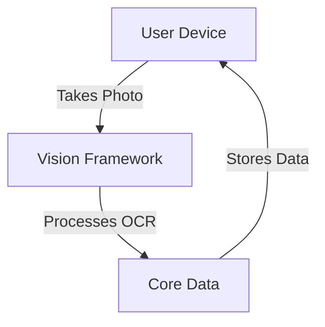

# SubscriptionSentry
**Track AI tool subscriptions with screenshot expense scanning**

SubscriptionSentry is an iOS application that allows users to photograph their credit card statements and app store receipts. Using on-device OCR, the app automatically categorizes AI subscriptions, calculates ROI metrics, and alerts users about redundant tools. It provides essential expense visibility for knowledge workers overwhelmed by the proliferation of AI tools like ChatGPT, Claude, and Midjourney.

## Features
- OCR receipt scanning
- AI subscription categorization
- Redundancy alerts

## Tech Stack
- **Frontend**: 
  - SwiftUI (version 3.0)
  - Vision Framework (part of iOS SDK)
- **Backend**: 
  - None (all functionalities are handled on-device)
- **Database**: 
  - Core Data (local storage for user data and subscription information)
- **Infrastructure**: 
  - iOS (Minimum iOS version 14.0)

## Architecture
SubscriptionSentry is a simple, on-device iOS application that leverages Apple's Vision Framework for OCR processing and Core Data for local storage. There is no backend infrastructure, ensuring all data processing remains on the user's device.



## Project Structure
```
SubscriptionSentry/
│
├── SubscriptionSentryApp.swift
├── ContentView.swift
├── Models/
│   ├── Subscription.swift
│   ├── Receipt.swift
│   └── UserSettings.swift
│
├── Views/
│   ├── DashboardView.swift
│   ├── ScanView.swift
│   ├── SettingsView.swift
│   └── AlertsView.swift
│
├── ViewModels/
│   ├── DashboardViewModel.swift
│   ├── ScanViewModel.swift
│   ├── SettingsViewModel.swift
│   └── AlertsViewModel.swift
│
├── Resources/
│   ├── Assets.xcassets
│   ├── Localizable.strings
│   └── Fonts/
│
├── CoreData/
│   ├── SubscriptionSentry.xcdatamodeld/
│   └── CoreDataStack.swift
│
├── Utils/
│   ├── OCRProcessor.swift
│   ├── SubscriptionCategorizer.swift
│   └── ROIAnalyzer.swift
│
└── Tests/
    ├── SubscriptionSentryTests/
    └── SubscriptionSentryUITests/
```

## Getting Started

### Prerequisites
- Xcode 13 or later
- iOS 14.0 or later

### Installation
1. Clone the repository:
   ```bash
   git clone https://github.com/yourusername/SubscriptionSentry.git
   ```
2. Open the project in Xcode:
   ```bash
   cd SubscriptionSentry
   open SubscriptionSentry.xcodeproj
   ```

### Environment Variables
No external environment variables are required as all processing is done on-device.

### Running
- Build and run the project in Xcode using a simulator or a connected iOS device.

## Documentation
- [Product Requirements](docs/PRD.md)
- [Design Brief](docs/DESIGN.md)
- [Architecture](docs/ARCHITECTURE.md)

## License
This project is licensed under the MIT License.